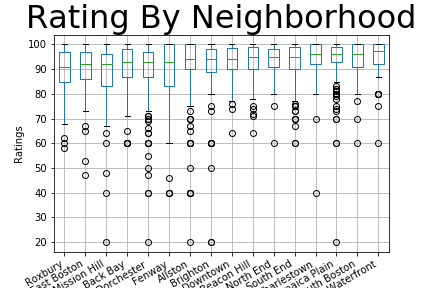
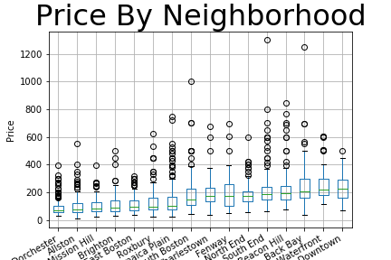
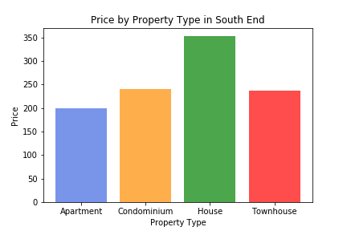
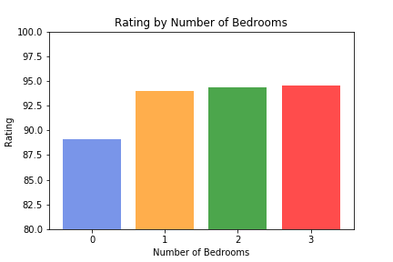

# GT BootCamp Project 1

## Introduction

Have you ever thought about making residual income? Purchasing property, and renting it out for profit is one of the most prominent ways people are generating residual income. But how? Airbnbs have become the world’s primary source for vacational renting properties. This company has made it easy for owners to manage their rental properties. The data analytics team at Foster & Palmer Consulting firm has been approached by a client interested in purchasing three matching properties in Boston, Massachusetts. We have been charged with determining if statistical analysis can provide a profile of the most profitable investment in this endeavor. We were able to obtain a dataset from Kaggle that gives great analysis over Boston’s Airbnb. It holds an in-depth analysis including ratings, location and availability.

## Hypothesis & Null Hypothesis

Hypothesis: An Airbnb, two-bedroom apartment located in Jamaica Plain, Boston is a significantly more profitable listing profile to purchase than other neighborhoods based on:
Price 
Overall Rating Score

Null: There is no statistical significance between neighborhoods and property types to purchase in Boston based on price and ratings

## Conclusion

Recommended Profile: two-bedroom, condominium in South End, Boston

The team had to first establish that there was a statistical significance between neighborhoods in Boston listed on Airbnb to purchase property in, based on price and ratings. Our analysis found p-values for price (1.85e-119) and ratings (2.19e-30) signalled statistically significant relationships with Boston neighborhoods listed on Airbnb. So the null hypothesis is rejected and we continued our analysis of the data to see the most profitable Boston neighborhood on Airbnb.

Neighborhood

We created box & whisker plots of the median price and ratings for listings in each neighborhood of interest to find which neighborhoods consistently generated high ratings at the highest prices. The analysis found that we rejected our hypothesis as South Boston Waterfront and South End neighborhoods were the only top areas that were top five in both plots; however, South Boston Waterfront has very little listings which we believe skewed the data and decided South End was the more significantly profitable neighborhood.

 

Property Type

In order to recommend the most profitable property type to purchase in South End, the team created bar graphs of the mean price and ratings for listings in South End to find which property type consistently generated high ratings at the highest prices. The analysis brought the team to reject the hypothesis that an apartment would be the most profitable property type as we found that condominiums perform the best when considering price and ratings. Townhouses had higher ratings but lower prices and Houses had higher prices but lower ratings. 
 
 
 
Bedrooms Available

The team conducted analysis based on bar graphs to determine the number of bedrooms available on listings that consistently scored high ratings while listing high prices. Our analysis found that although two and three bedroom listings had comparable mean ratings, three bedrooms listed significantly higher prices. With three-bedrooms listings being such a low percentage (2.6%) of the properties listed in South End, the data team accepted the hypothesis that a two-bedroom property would be significantly more profitable.

 

Beyond the Data

Further analysis that could have been done was a value analysis in order to determine the most profitable price range to list the properties once purchased. From the current data the team would be able to pull the five listings in South End with the highest prices and begin analysis from there. Additional information not included in this dataset the team could use is data related to maintenance costs of similar Airbnb listings in the area.
Once the properties were listed, property management will also affect profitability so further analysis could’ve been done to determine best host practices. The current dataset would allow the team to analyze response rate and response time of hosts as well as strictness of cancellation policy against overall rating scores. Additional qualitative data on guests compliments and complaints could also offer valuable analysis but was not available in this current dataset.
